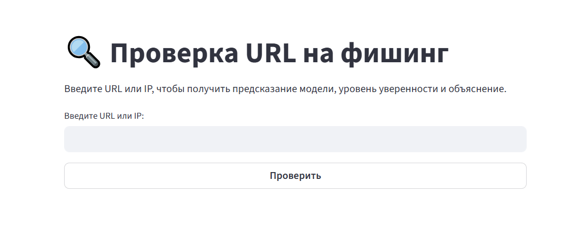

# 🛡️ Phishing URL Detector
Приложение для определения фишинговых URL с помощью модели Random Forest. Проект включает FastAPI, Streamlit-интерфейс, Docker и тесты с Pytest.

## Возможности
* Проверка URL или IP на фишинг
* Объяснение решения модели с эвристическими признаками
* Поддержка доверенных доменов (`trusted_domains.json`).
* Модель Random Forest
* Уровень уверенности модели
* Streamlit-интерфейс для визуального ввода
* API на FastAPI
* Docker и docker-compose для запуска



## Стек технологий
* Python 3.10
* RandomForestClassifier
* FastAPI
* Streamlit
* Docker
* Pytest
* GitHub Actions

## Обучение модели
Сравнение моделей Random Forest, Logistic Regression, SVM и Neural Network представлен в **/model_training/Models_comparison.ipynb**
Процесс настройки Random Forest представлен в **/model_training/RandomForest_tuning.ipynb**

## Запуск проекта c Docker
```
docker-compose up --build
```
FastAPI: http://localhost:8000/docs

Streamlit: http://localhost:8501

## Запуск без Docker
```
pip install -r requirements.txt

uvicorn api.api:app --reload

streamlit run ui/app.py
```
